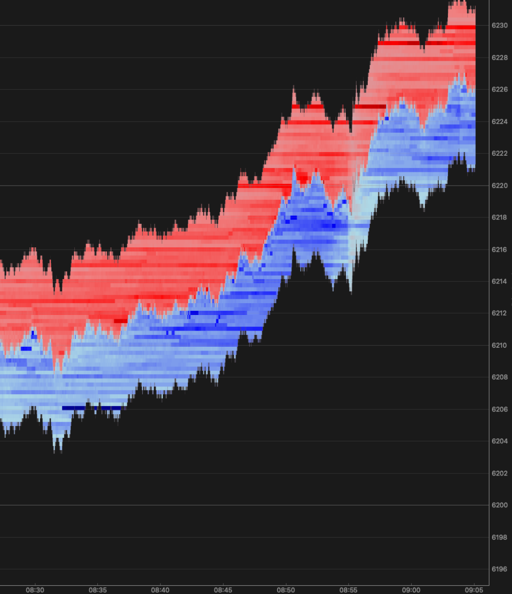

# Real-Time Orderbook Visualization

Live market data heatmap with whale order tracking and temporal depth analysis.


## Features

- **Real-time orderbook heatmap** with PyQtGraph visualization
- **Large order tracking** - whale detection and lifecycle monitoring
- **Temporal visualization** - time-based depth analysis
- **Interactive controls** - configurable whale thresholds
- **Live data streaming** from Databento professional market data

## Sample Output



*Real-time orderbook depth heatmap with bid/ask visualization*

## Technical Architecture

```
Databento Live API → In-Memory OrderBook → PyQtGraph Heatmap
```

**Core Technologies:**
- **PySide6** - Desktop GUI framework
- **PyQtGraph** - Real-time plotting and visualization
- **Databento** - Professional market data API
- **NumPy** - Numerical array operations
- **Custom OrderBook Engine** - In-memory order tracking
- **Whale Tracker** - Large order lifecycle monitoring

**Key Features:**
- Real-time data streaming with QThread
- Interactive heatmap visualization
- Large order detection and tracking
- Configurable whale size thresholds
- Temporal depth analysis

## Data Processing

### OrderBook Engine
- **In-memory order tracking** - Fast access to current market state
- **Price-time priority** - Standard order book organization
- **Real-time updates** - Add/Modify/Cancel order processing
- **Efficient data structures** - Custom price level management

### Real-time Heatmap Visualization
- **Temporal depth analysis** - Time flows left-to-right across heatmap
- **Price-level granularity** - 0.25 tick precision for ES futures
- **Bid/Ask color mapping** - Blue (bids at bottom) vs Red (asks at top)
- **Dynamic price range** - Auto-adjusts around best bid/offer
- **Matrix transpose optimization** - Proper PyQtGraph orientation

### Whale Order Tracking
- **Large order detection** - Configurable size thresholds
- **Order lifecycle monitoring** - Add/Modify/Cancel tracking
- **Visual overlays** - Colored rectangles showing whale positions
- **Historical preservation** - Completed order tracking
- **Order ID mapping** - Full lifecycle from placement to completion

### Live Data Processing
- **Databento MBO streaming** - Market-by-order level 3 data
- **Snapshot initialization** - Full orderbook state on startup
- **Real-time order processing** - Sub-second update cycles
- **Thread-safe operations** - QThread-based data streaming

## Implementation Details

### Application Architecture
- **Main Window** - PySide6 QMainWindow with control buttons
- **Data Thread** - QThread for live Databento streaming
- **Heatmap Widget** - PyQtGraph-based visualization component
- **Whale Tracker** - Large order detection and lifecycle management

### Technical Implementation
- **Matrix transpose optimization** - Proper PyQtGraph ImageItem orientation
- **Dynamic price ranging** - Auto-adjustment around best bid/offer
- **Thread-safe operations** - Signal/slot communication between threads
- **Memory management** - Efficient NumPy array operations


## Skills Demonstrated

**Desktop Application Development:**
- PySide6 GUI application architecture
- Multi-threaded application design
- Real-time data visualization
- Interactive user interface controls

**Financial Data Processing:**
- Market data API integration (Databento)
- Order book reconstruction and management
- Large order detection and tracking
- Real-time market depth analysis

**Data Visualization:**
- PyQtGraph real-time plotting
- Heatmap visualization techniques
- Custom colormap and axis formatting
- Matrix orientation and data mapping

**Software Engineering:**
- Modular code organization
- Thread-safe communication patterns
- Configuration management
- Error handling and logging

---

**Note**: This project demonstrates real-time financial data visualization with professional market data integration and interactive analysis tools.
